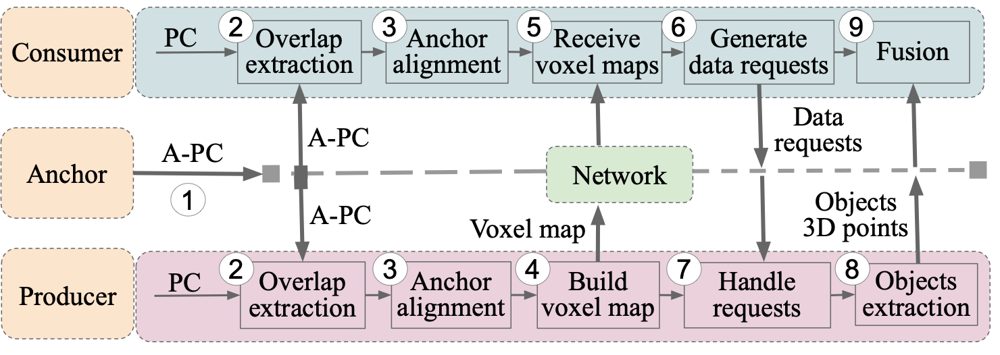

# ARC: Accurate, Real-Time, and Scalable Multi-Vehicle Cooperative Perception

This repository contains the official code for the paper: **[ARC: Accurate, Real-Time, and Scalable Multi-Vehicle Cooperative Perception](https://kaleemnwzkhan.github.io/assets/pdf/ARC.pdf)**.

---

## Table of Contents
1. [System Architecture Overview](#system-architecture-overview)
2. [Setup Environment](#setup-environment)
3. [Dataset Preparation](#dataset-preparation)
4. [Step-by-Step Run Instructions](#step-by-step-run-instructions)
    - [Phase 1: Localization and Alignment](#phase-1-localization-and-alignment)
    - [Phase 2: Communication Pipeline](#phase-2-communication-pipeline)
5. [Evaluation and Plotting](#evaluation-and-plotting)
    - [Accuracy Evaluation](#accuracy-evaluation)
    - [Latency Evaluation](#latency-evaluation)
    - [Network/Bandwidth Evaluation](#networkbandwidth-evaluation)
6. [Citation](#citation)

---

## System Architecture Overview

To better understand the ARC system workflow, please refer to our core architectural diagrams below:


### End-to-End System Architecture

<p align="center">
  
</p>


---

## Setup Environment

The ARC framework is fully containerized to ensure a smooth and reproducible setup process. We use a Docker container loaded with all the required dependencies.

### Prerequisites
Before starting, ensure you have the following installed on your machine:
- [Docker](https://docs.docker.com/engine/install/ubuntu/)
- [NVIDIA Container Toolkit (NVIDIA-Docker)](https://docs.nvidia.com/datacenter/cloud-native/container-toolkit/install-guide.html) for GPU acceleration.

### Docker Setup
To get started, download the pre-built Docker container for this project:

```bash
docker pull kk5271/rapid_v2v:1.0
```

Verify that the image has been pulled successfully:

```bash
docker images
```

You should see `kk5271/rapid_v2v:1.0` listed. When running the Docker container, ensure you mount your local dataset and codebase directories properly (e.g., using `-v /path/to/local/data:/dataset`).

---

## Dataset Preparation

1. Download the ARC dataset from [this Google Drive link](https://drive.google.com/drive/folders/1Q374JyFSiZ8mbfJZweNIv9sgqCm8VhnQ?usp=sharing).
2. Extract the downloaded contents into a local `Dataset` folder.

This repository requires a specific directory structure to process the dataset:
- **`/dataset/Vehicles`**: Contains the source data sequences for every vehicle present in the scene.
- **`/dataset/Leader`**: Contains reference data (such as `PCDs` point clouds and `Leader_Poses.txt`) for the vehicle designated as the network "anchor" or "leader".
- **`/dataset/Communication`**: Will hold all intermediary variables like blindspots, latency metrics, and required cells (details below).

---

## Step-by-Step Run Instructions

This codebase is conceptually split into multiple phases: localization, alignment, and finally establishing vehicle communication. Follow these steps meticulously to reproduce our outcomes.

### Phase 1: Localization and Alignment

**Step 1: Start the Docker Environment**
Ensure you are running inside a container instantiated from the `kk5271/rapid_v2v:1.0` image.

**Step 2: Vehicle Localization**
Generate ego-poses and tracking latencies for all vehicles.
```bash
cd /workspace/Localization_and_Alignment/catkin_ws/
bash Vehicle_Localization.sh
```
*Output:* Inside each vehicle directory under `/dataset/Vehicles`, this script creates `Poses.txt` and `Latencies.txt`.

**Step 3: Leader/Anchor Definition**
For simplicity in our default configuration, we designate a single vehicle as the "leader" throughout a 15-second duration. 
You must copy the localization results and point clouds of the chosen leader to the designated leader directories:
- Point Clouds: `/dataset/Leader/PCDs`
- Poses: `/dataset/Leader/Leader_Poses.txt`

**Step 4: Fast Overlap Extraction**
Execute the Fast Overlap Extraction Algorithm. This identifies and extracts structurally overlapping regions shared between the vehicles and the leader over continuous frames.
```bash
cd Overlap_extraction
bash Overlap_extraction.sh
```

**Step 5: Vehicle-to-Leader Ground Truth Calculation**
Calculate the precise ground-truth spatial transformations between all vehicles and the anchor/leader.
```bash
cd /workspace/Localization_and_Alignment
bash Vehicle_to_Leader_Ground_Truth.sh
```

**Step 6: Anchor-based Direct Alignment**
Run the direct alignment process using the chosen anchor.
```bash
bash Anchor_based_Direct_Alignment.sh
```

**Step 7: Vehicle-to-Vehicle (V2V) Ground Truth Alignment**
Generate the absolute V2V ground truth connections and evaluate intermediate tracking trajectories.
```bash
bash Vehicle_to_Vehicle_GT.sh
```
*Output:* Within every individual vehicle folder, three new evaluation subdirectories are created:
- `V2V_Direct`: End-to-end V2V alignment achieved via indirect mapping.
- `V2V_Leader`: End-to-end V2V alignment leveraging the anchor-based mechanism.
- `V2V_GT`: The reference Vehicle-to-Vehicle ground truth alignment.

### Phase 2: Communication Pipeline

To evaluate the system's runtime communication efficiency, ARC calculates required blindspot matrices.

**Pre-requisite Directory Structure:** Ensure the `/dataset/Communication` folder holds subdirectories like:
- `All_Vehicles_Leader_Transforms_Folder` (per-frame transforms)
- `BlindSpots` & `BlindSpots_Size`
- `Vehicle_Cells` & `Require_Cells`
- `output_directory`
- `Producer_BlindSpot_Latencies` & `Subscriber_BlindSpot_Latencies`

**Step 1: Subscriber Processing**
```bash
cd /workspace/Vehicle_Communication
./Subscriber_test.sh
```
*Effect:* Populates required initial data to `BlindSpots`, `Vehicle_Cells`, and records latency in `Subscriber_BlindSpot_Latencies`.

**Step 2: Publisher Assignment**
```bash
./Publisher_Assignment_test.sh
```
*Effect:* Analyzes the required cells for each blindspot and maps a responsive publisher vehicle. Outputs are dispatched to the `/dataset/Communication/Required` directory.

**Step 3: Data Rearrangement**
```bash
python3 Rearranging_files.py
```
*Effect:* Organizes and formats the assigned publisher cells, converting them directly to the spatial cells required for each vehicle per frame. 

**Step 4: Publisher Processing and Extraction**
```bash
./Publisher_test.sh
```
*Effect:* The designated publishers process, extract, and provide the respective blindspot point cloud information.

---

## Evaluation and Plotting

After running the end-to-end pipeline, use our embedded scripts to generate analytical plots for accuracy, latency, and network bandwidth.

### Accuracy Evaluation

**1. Calculate Alignment Errors**
Quantify spatial relative errors for both direct mapping and our proposed anchor-based mapping technique.
```bash
cd /workspace/Localization_and_Alignment
bash V2V_E2E_Direct_Error.sh
bash V2V_E2E_Lead_Error.sh
```
This generates four evaluation files in the `Dataset/Results` directory: `RTE_V2V_Direct.txt`, `RRE_V2V_Direct.txt`, `RTE_V2V_Lead.txt`, and `RRE_V2V_Lead.txt`.

**2. Remove Data Redundancy**
Because alignments are calculated densely (combining all vehicles with all vehicles, including self-connections like A→A, and bi-directional mirrors like A→B and B→A), we inherently generate redundant values. Furthermore, alignments lacking statistically significant spatial point cloud overlap inherently increase alignment boundaries artificially.
```bash
cd /workspace/Scripts_and_Plots/Accuracy
python3 Remove_Redundancy.py
```

**3. Generate Final Accuracy Plots**
```bash
python3 Plot.py
```
Accuracy curves detailing error characteristics over iterations will be plotted in the same `Accuracy` directory.

### Latency Evaluation

For ARC, we evaluate end-to-end compute latency strictly across its core sequential routines. Generate latency metrics progressively, then aggregate them.

1. **Localization Latency:** `python3 /workspace/Scripts_and_Plots/Latencies/Localization.py`
2. **Overlap Estimation Latency:** `python3 /workspace/Scripts_and_Plots/Latencies/Overlap_Latencies.py`
3. **Anchor Alignment Latency:** `python3 /workspace/Scripts_and_Plots/Latencies/Anchor_Alignment_Latencies.py`
4. **Publisher Assignment Latency:** `python3 /workspace/Scripts_and_Plots/Latencies/Publisher_Assignment_Latency.py`
5. **Publisher Processing Latency:** `python3 /workspace/Scripts_and_Plots/Latencies/Publisher_Latencies.py`
6. **Consumer Processing Latency:** `python3 /workspace/Scripts_and_Plots/Latencies/Consumer_Latency.py`

**Plot Computation:**
Once all execution variables are captured:
```bash
python3 /workspace/Scripts_and_Plots/Latencies/Plot_Latencies.py
```
This script computes the end-to-end aggregate latency plot.

### Network/Bandwidth Evaluation

We evaluate the structural bandwidth consumption (in Mbps) required by interacting vehicles globally across the network.

1. **Subscriber Bandwidth:** `python3 Subscriber_Sizes.py` (Combines the size footprint of data consumed by subscribers).
2. **Publisher Bandwidth:** `python3 Publisher_Sizes.py` (Calculates the overhead data payload size produced per publisher).
3. **Aggregate Plot Generation:** `python3 Combined_Plot.py` (Merges metadata, anchor distributions, as well as publisher and subscriber throughput streams to render the total bandwidth requirement map).

---

## Citation
If you utilize our codebase, architecture, or dataset in your research workflows, please consider citing our work:

```bibtex
@inproceedings{khan2026arc,
  title={ARC: Accurate, Real-Time, and Scalable Multi-Vehicle Cooperative Perception},
  author={Khan, Kaleem Nawaz and Ahmad, Fawad},
  booktitle={ACM/IEEE International Conference on Embedded Artificial Intelligence and Sensing Systems},
  year={2026}
}
```
